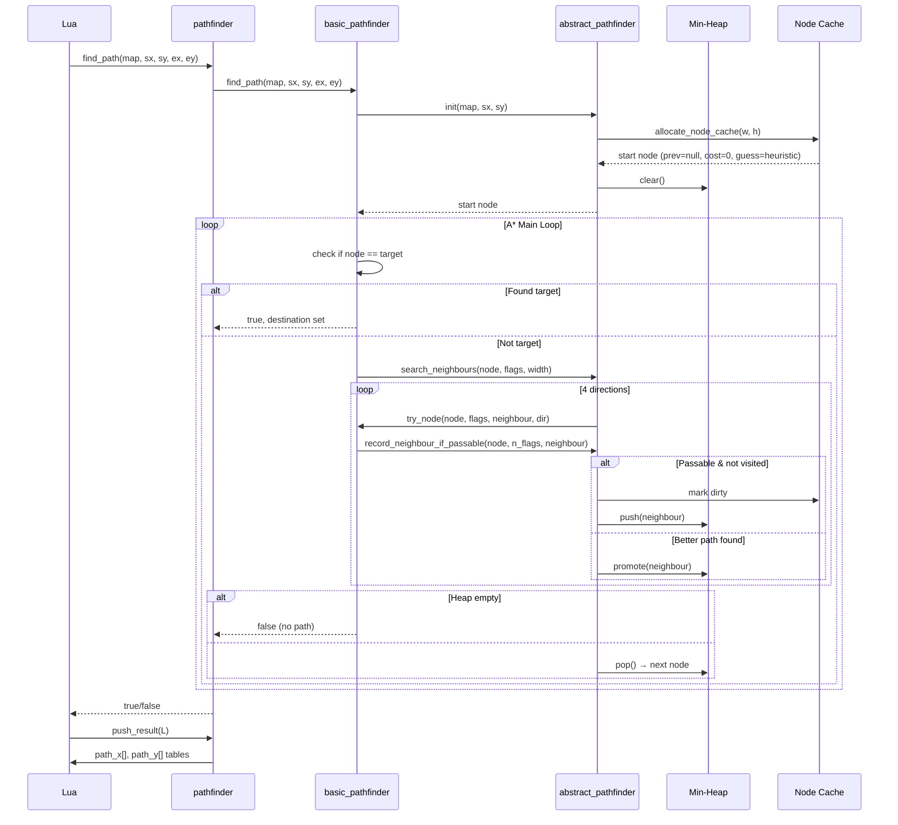
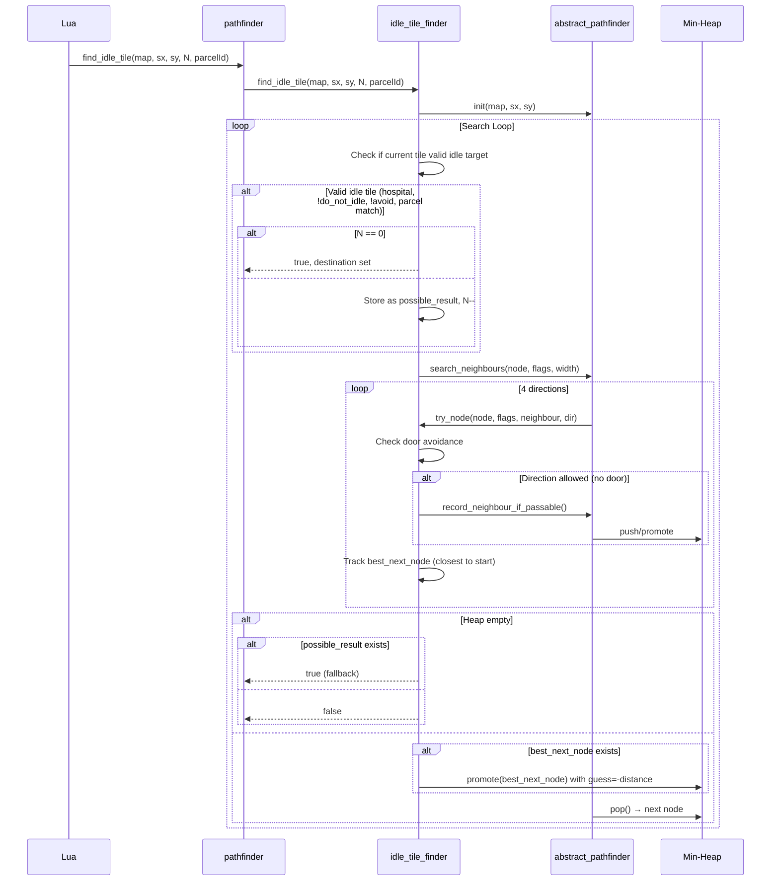
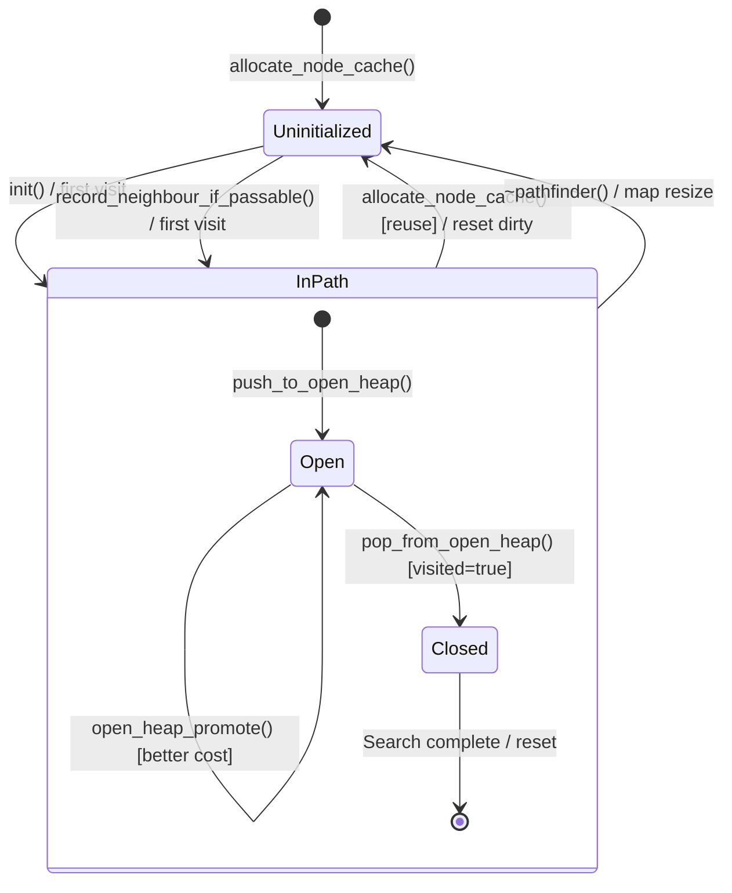
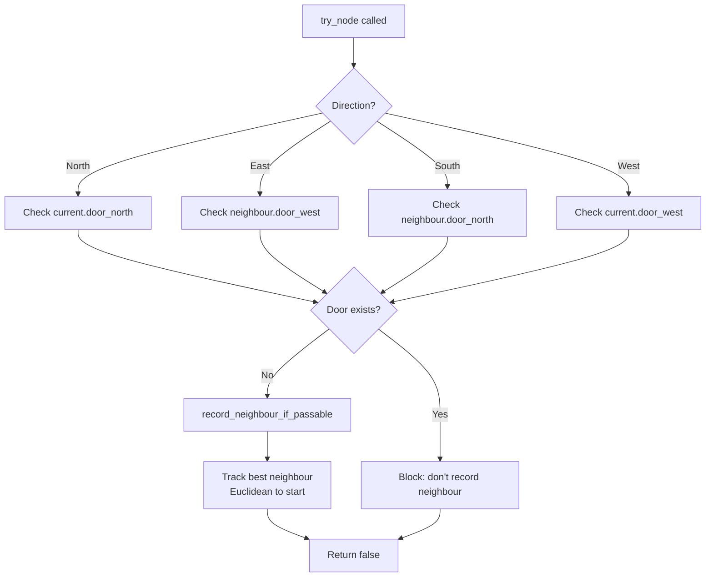

# Pathfinding System (Area 21) - Class Diagram

Mermaid diagram showing the class hierarchy and relationships.

---

## Class Hierarchy

```mermaid
classDiagram
    %% Abstract base
    class abstract_pathfinder {
        #pathfinder* parent
        #const level_map* map
        +abstract_pathfinder(pathfinder* pf)
        +path_node* init(const level_map* pMap, int iStartX, int iStartY)
        +bool search_neighbours(path_node* pNode, map_tile_flags flags, int iWidth)
        +void record_neighbour_if_passable(path_node* pNode, map_tile_flags neighbour_flags, path_node* pNeighbour)
        #virtual int guess_distance(path_node* pNode) = 0
        #virtual bool try_node(path_node* pNode, map_tile_flags flags, path_node* pNeighbour, travel_direction direction) = 0
    }

    %% Concrete finders
    class basic_pathfinder {
        -int destination_x
        -int destination_y
        +basic_pathfinder(pathfinder* pf)
        +int guess_distance(path_node* pNode)
        +bool try_node(path_node* pNode, map_tile_flags flags, path_node* pNeighbour, travel_direction direction)
        +bool find_path(const level_map* pMap, int iStartX, int iStartY, int iEndX, int iEndY)
    }

    class hospital_finder {
        +hospital_finder(pathfinder* pf)
        +int guess_distance(path_node* pNode)
        +bool try_node(path_node* pNode, map_tile_flags flags, path_node* pNeighbour, travel_direction direction)
        +bool find_path_to_hospital(const level_map* pMap, int iStartX, int iStartY)
    }

    class idle_tile_finder {
        -path_node* best_next_node
        -double best_distance
        -int start_x
        -int start_y
        +idle_tile_finder(pathfinder* pf)
        +int guess_distance(path_node* pNode)
        +bool try_node(path_node* pNode, map_tile_flags flags, path_node* pNeighbour, travel_direction direction)
        +bool find_idle_tile(const level_map* pMap, int iStartX, int iStartY, int iN, int parcelId)
    }

    class object_visitor {
        -lua_State* L
        -int visit_function_index
        -int max_distance
        -bool target_any_object_type
        -object_type target
        +object_visitor(pathfinder* pf)
        +int guess_distance(path_node* pNode)
        +bool try_node(path_node* pNode, map_tile_flags flags, path_node* pNeighbour, travel_direction direction)
        +bool visit_objects(const level_map* pMap, int iStartX, int iStartY, object_type eTHOB, int iMaxDistance, lua_State* L, int iVisitFunction, bool anyObjectType)
    }

    %% Facade
    class pathfinder {
        -const level_map* default_map
        -vector~path_node~ nodes
        -path_node** dirty_node_list
        -vector~path_node*~ open_heap
        -path_node* destination
        -int node_cache_width
        -int node_cache_height
        -int dirty_node_count
        -basic_pathfinder basic_pathfinder
        -hospital_finder hospital_finder
        -idle_tile_finder idle_tile_finder
        -object_visitor object_visitor
        +pathfinder()
        +~pathfinder()
        +void set_default_map(const level_map* pMap)
        +bool find_path(const level_map* pMap, int iStartX, int iStartY, int iEndX, int iEndY)
        +bool find_idle_tile(const level_map* pMap, int iStartX, int iStartY, int iN, int parcelId)
        +bool find_path_to_hospital(const level_map* pMap, int iStartX, int iStartY)
        +bool visit_objects(const level_map* pMap, int iStartX, int iStartY, object_type eTHOB, int iMaxDistance, lua_State* L, int iVisitFunction, bool anyObjectType)
        +int get_path_length() const
        +bool get_path_end(int* pX, int* pY) const
        +void push_result(lua_State* L) const
        +void persist(lua_persist_writer* pWriter) const
        +void depersist(lua_persist_reader* pReader)
        +void allocate_node_cache(int iWidth, int iHeight)
        +path_node* pop_from_open_heap()
        +void push_to_open_heap(path_node* pNode)
        +void open_heap_promote(path_node* pNode)
    }

    %% Supporting structures
    class path_node {
        +const path_node* prev
        +int x
        +int y
        +int cost
        +int distance
        +int guess
        +size_t open_idx
        +bool visited
        +int value() const
    }

    class map_tile_flags {
        +bool passable
        +bool can_travel_n
        +bool can_travel_e
        +bool can_travel_s
        +bool can_travel_w
        +bool hospital
        +bool buildable
        +bool passable_if_not_for_blueprint
        +bool room
        +bool shadow_half
        +bool shadow_full
        +bool shadow_wall
        +bool door_north
        +bool door_west
        +bool do_not_idle
        +bool tall_north
        +bool tall_west
        +bool buildable_n
        +bool buildable_e
        +bool buildable_s
        +bool buildable_w
        +bool avoid_tile
        +operator=(uint32_t raw)
        +operator[](key)
        +operator uint32_t() const
    }

    class map_tile {
        +link_list entities
        +link_list oEarlyEntities
        +uint16_t tile_layers[4]
        +uint16_t iParcelId
        +uint16_t iRoomId
        +uint16_t aiTemperature[2]
        +map_tile_flags flags
        +list~object_type~ objects
        +uint8_t raw[8]
    }

    class level_map {
        +map_tile* cells
        +map_tile* original_cells
        +int width
        +int height
        +int parcel_count
        +int* plot_owner
        +void update_pathfinding()
        +void update_shadows()
        +map_tile* get_tile(int, int)
        +const map_tile* get_tile_unchecked(int, int) const
    }

    class travel_direction {
        <<enumeration>>
        north
        east
        south
        west
    }

    class object_type {
        <<enumeration>>
        no_object
        desk
        cabinet
        door
        bench
        table
        chair
        drinks_machine
        bed
        inflator
        pool_table
        reception_desk
        scanner
        scanner_console
        screen
        litter_bomb
        couch
        sofa
        crash
        tv
        ultrascan
        dna_fixer
        cast_remover
        hair_restorer
        slicer
        xray
        radiation_shield
        xray_viewer
        op_table
        lamp
        sink
        op_sink1
        op_sink2
        surgeon_screen
        lecture_chair
        projector
        pharmacy
        computer
        chemical_mixer
        blood_machine
        extinguisher
        radiator
        plant
        electro
        jelly_vat
        hell
        bin
        loo
        double_door1
        double_door2
        decon_shower
        autopsy
        bookcase
        video_game
        entrance_left_door
        entrance_right_door
        skeleton
        comfy_chair
        litter
        helicopter
        rathole
    }

    %% Inheritance
    abstract_pathfinder <|-- basic_pathfinder
    abstract_pathfinder <|-- hospital_finder
    abstract_pathfinder <|-- idle_tile_finder
    abstract_pathfinder <|-- object_visitor

    %% Composition
    pathfinder *-- basic_pathfinder : "basic_pathfinder"
    pathfinder *-- hospital_finder : "hospital_finder"
    pathfinder *-- idle_tile_finder : "idle_tile_finder"
    pathfinder *-- object_visitor : "object_visitor"

    pathfinder *-- path_node : "nodes[width*height]"
    pathfinder *-- path_node : "dirty_node_list[width*height]"
    pathfinder *-- path_node : "open_heap[dynamic]"

    pathfinder --> level_map : "default_map"
    abstract_pathfinder --> level_map : "map (during search)"

    abstract_pathfinder --> path_node : "init, search, record"
    basic_pathfinder --> path_node : "find_path"
    hospital_finder --> path_node : "find_path_to_hospital"
    idle_tile_finder --> path_node : "find_idle_tile"
    object_visitor --> path_node : "visit_objects"

    path_node --> path_node : "prev (path chain)"
    map_tile --> map_tile_flags : "flags"
    map_tile --> object_type : "objects[]"
    level_map --> map_tile : "cells[width*height]"

    %% Lua boundary (conceptual)
    class Lua_State {
        <<external>>
    }
    object_visitor --> Lua_State : "L"
```



---

## Sequence Diagram: Basic Pathfind



---

## Sequence Diagram: Idle Tile Find (with Door Avoidance)



---

## State Diagram: Path Node Lifecycle



---

## Component Diagram: System Boundaries

```mermaid
graph TB
    subgraph "C++ Core"
        PF[pathfinder]
        APF[abstract_pathfinder]
        BPF[basic_pathfinder]
        HF[hospital_finder]
        ITF[idle_tile_finder]
        OV[object_visitor]
        Heap[Min-Heap]
        NCache[Node Cache]
        Map[level_map]
        Tile[map_tile]
        Flags[map_tile_flags]
    end

    subgraph "Lua Game Logic"
        MapLua[Map.lua]
        EntMap[entity_map.lua]
        World[world.lua]
        Calls[CallsDispatcher]
        PatientAI[Patient AI]
        StaffAI[Staff AI]
    end

    subgraph "Persistence"
        PWriter[lua_persist_writer]
        PReader[lua_persist_reader]
    end

    %% C++ Internal
    PF --> APF
    PF --> BPF
    PF --> HF
    PF --> ITF
    PF --> OV
    PF --> Heap
    PF --> NCache
    BPF --> APF
    HF --> APF
    ITF --> APF
    OV --> APF
    APF --> Heap
    APF --> NCache
    APF --> Map
    Map --> Tile
    Tile --> Flags

    %% Lua ↔ C++ Boundary
    MapLua -.-> PF : findPath, findIdleTile\nfindPathToHospital, visitObjects
    PF -.-> MapLua : push_result → path tables
    OV -.-> MapLua : Lua callback (x,y,dir,dist)
    World -.-> MapLua : getRoomId, getCellFlag
    Calls -.-> StaffAI : assign calls
    StaffAI -.-> MapLua : path requests
    PatientAI -.-> MapLua : path requests

    %% Persistence
    PF -.-> PWriter : persist()
    PF -.-> PReader : depersist()
```

---

## Key Relationships Summary

| Relationship | Type | Description |
|--------------|------|-------------|
| `abstract_pathfinder` → `basic_pathfinder` | Inheritance | Point-to-point A* |
| `abstract_pathfinder` → `hospital_finder` | Inheritance | Dijkstra to hospital flag |
| `abstract_pathfinder` → `idle_tile_finder` | Inheritance | Dijkstra + door avoidance + Nth tile |
| `abstract_pathfinder` → `object_visitor` | Inheritance | Dijkstra + Lua callback + door avoidance |
| `pathfinder` → 4 finders | Composition | Facade owns all finders |
| `pathfinder` → `path_node[]` | Aggregation | Node cache (width×height) |
| `pathfinder` → `path_node*[]` | Aggregation | Dirty node list (width×height) |
| `pathfinder` → `path_node*[]` | Aggregation | Min-heap (dynamic) |
| `abstract_pathfinder` → `level_map` | Association | Search operates on map |
| `path_node` → `path_node` | Self-reference | `prev` forms path chain |
| `map_tile` → `map_tile_flags` | Composition | Flags embedded in tile |
| `map_tile` → `object_type[]` | Aggregation | Objects on tile |
| `level_map` → `map_tile[]` | Composition | 2D tile grid |
| `object_visitor` → `lua_State` | Dependency | Calls Lua mid-search |

---

## Heuristic Comparison

```mermaid
graph LR
    subgraph "Heuristics"
        H1[Basic: Manhattan\n|dx|+|dy|]
        H2[Hospital: Zero\nDijkstra]
        H3[Idle: Zero\nDijkstra + promotion]
        H4[Visitor: Zero\nDijkstra + maxDist]
    end

    subgraph "Properties"
        P1[Admissible ✓]
        P2[Consistent ✓]
        P3[Optimal for grid ✓]
        P4[Slow but correct ✓]
        P5[Promotes nearest to start]
        P6[Limited by maxDistance]
    end

    H1 --> P1
    H1 --> P2
    H1 --> P3
    H2 --> P1
    H2 --> P4
    H3 --> P1
    H3 --> P4
    H3 --> P5
    H4 --> P1
    H4 --> P4
    H4 --> P6
```

---

## Door Avoidance Logic (Idle & Visitor)



---

## Min-Heap Operations

```mermaid
flowchart TD
    subgraph "Push"
        P1[push_to_open_heap] --> P2[Append to vector]
        P2 --> P3[open_idx = size-1]
        P3 --> P4[open_heap_promote]
        P4 --> P5[Bubble up:\nwhile parent.value > node.value:\n  swap with parent]
    end

    subgraph "Pop"
        O1[pop_from_open_heap] --> O2[Save root as result]
        O2 --> O3[Move last to root]
        O3 --> O4[Pop back]
        O4 --> O5{Heap empty?}
        O5 -->|Yes| O6[Return result]
        O5 -->|No| O7[Sink down:\nwhile child.value < node.value:\n  swap with smallest child]
        O7 --> O6
    end

    subgraph "Promote (Decrease Key)"
        PR1[open_heap_promote] --> PR2[Bubble up from current idx]
        PR2 --> PR3[Validate open_heap[idx] == node]
    end
```

---

## File Organization

```
Src/
├── th_pathfind.h     # Declarations (334 lines)
├── th_pathfind.cpp   # Implementation (677 lines)
├── th_map.h          # Map/tile/flags (620 lines)
├── th_map.cpp        # Map implementation (1522+ lines)

Lua/
├── map.lua           # Map wrapper (965 lines)
├── entity_map.lua    # Entity tracking (218 lines)
├── world.lua         # World queries (3009 lines)
├── calls_dispatcher.lua  # Call dispatch (567 lines)
```


## Related Pages

- [[21-pathfinding/SUMMARY]]
- [[21-pathfinding/CHECKLIST]]
- [[21-pathfinding/MAP]]
- [[21-pathfinding/SCAFFOLD]]
