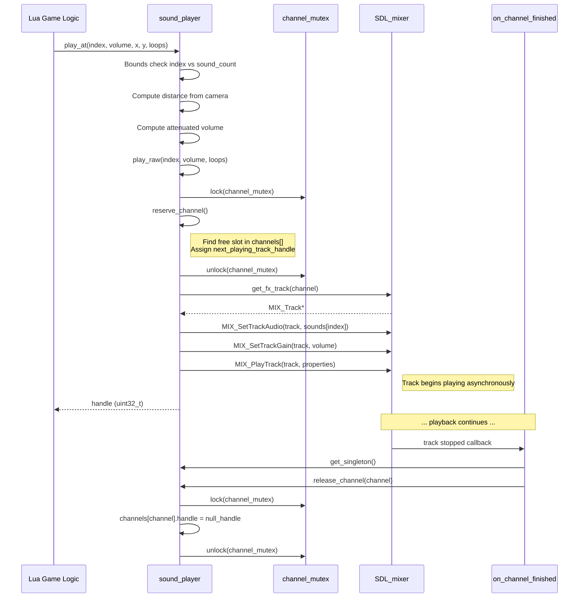
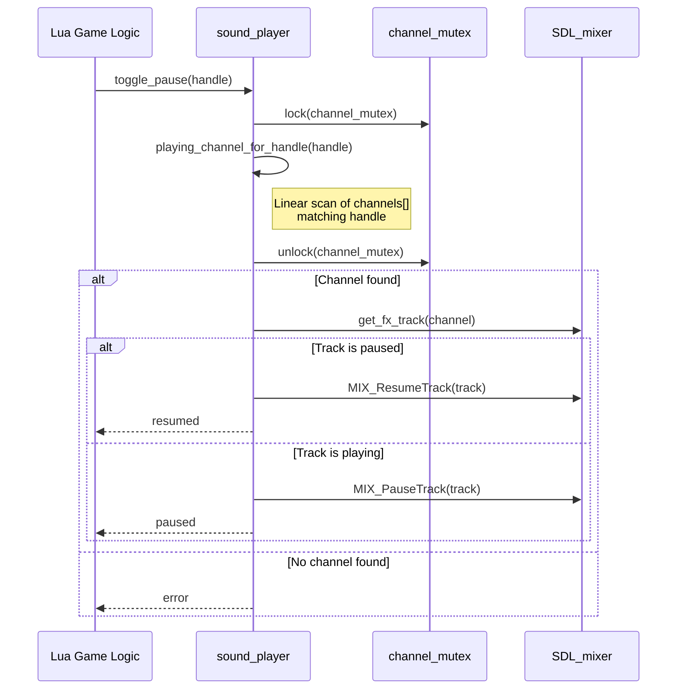
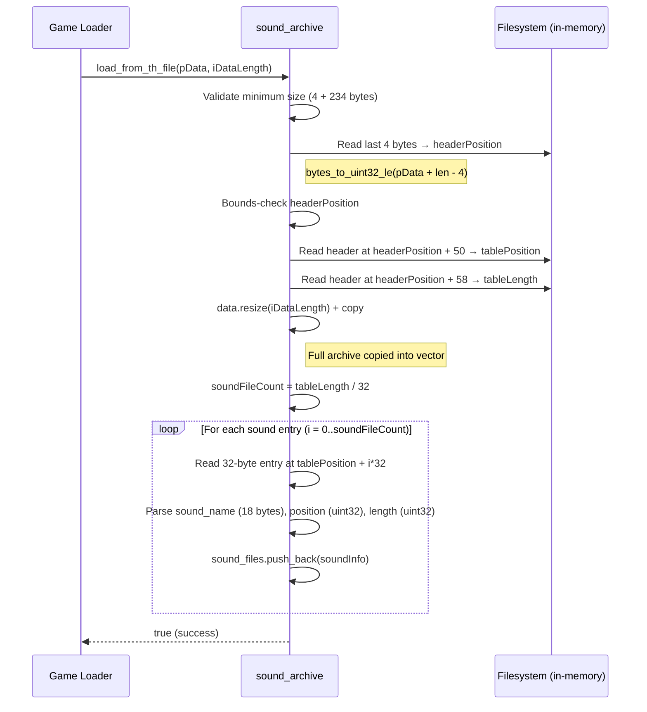
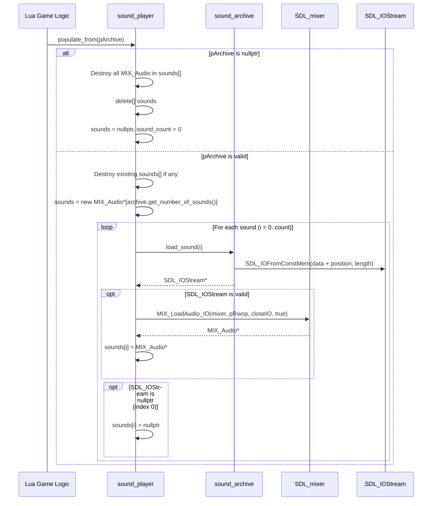
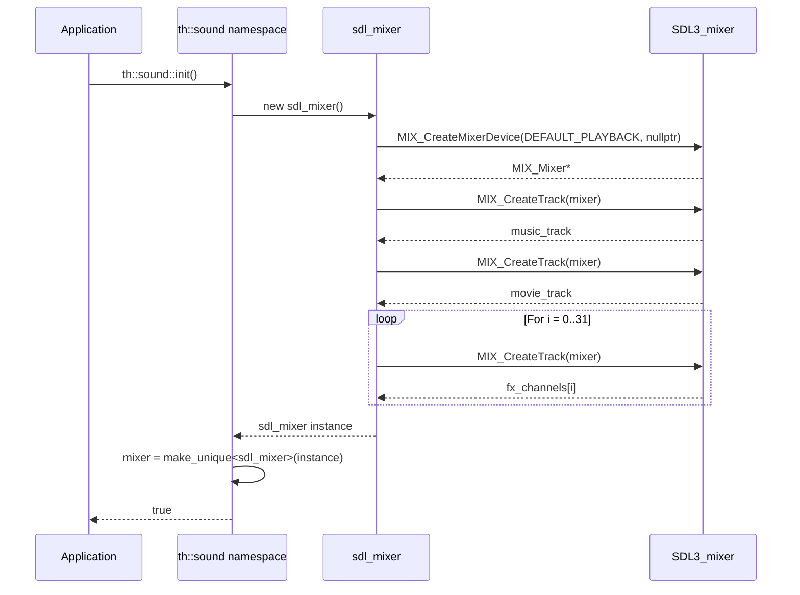

# Audio System — Sequence Diagrams

> **Mermaid sequence diagrams for key audio subsystem flows**

## 1. Sound Playback Flow

---

## 2. Pause/Resume Flow

---

## 3. Sound Archive Loading Flow

---

## 4. populate_from Flow (Pre-loading All Sounds)

---

## 5. Mixer Initialization Flow

---

## Related Pages

- [[SUMMARY]] — Full technical reference
- [[CLASS_DIAGRAM]] — Class hierarchy visualization
- [[MAP]] — Source file line index
