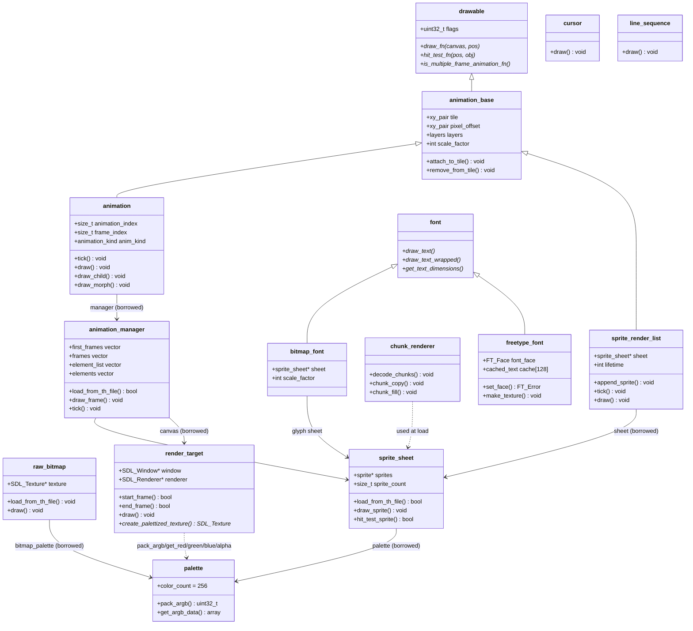

# Core Graphics — Class Diagram

## Relationships

| Edge | Meaning |
|------|---------|
| manager → sheet/canvas | borrowed, set via `set_sprite_sheet` / `set_canvas` |
| animation → manager | borrowed, set via `set_animation` |
| sheet → palette | borrowed, set via `set_palette` |
| lazy texture | `draw_sprite` uploads on first use; `raw_bitmap` uploads at load |

## Related pages

- [[core-graphics/SUMMARY]] — overview
- [[core-graphics/MAP]] — file:line index
- [[core-graphics/SPEC]] — data formats
