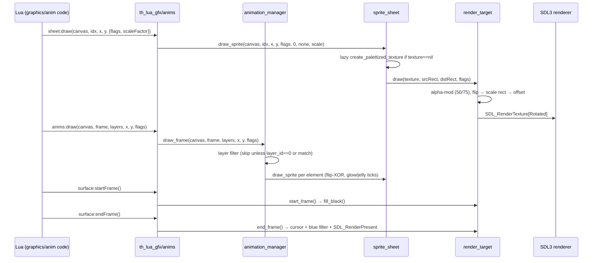
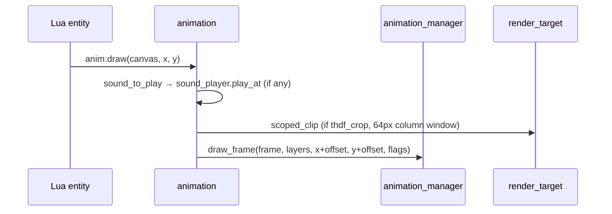

# Core Graphics — Render-Path Sequence

> Primary path: Lua `sheet:draw / anims:draw / animation:draw` → C++ → SDL present.

## Alternate: animation:draw with sound + crop

## Related pages

- [[core-graphics/SUMMARY]] — overview
- [[core-graphics/MAP]] — file:line index
- [[core-graphics/SPEC]] — sprite/palette formats
