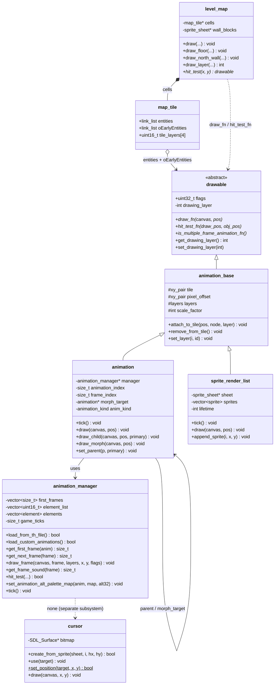

# Entity Rendering — Class Diagram

## Related Pages

- [[entity-rendering/SUMMARY]] — overview
- [[entity-rendering/MAP]] — file:line index
- [[entity-rendering/SEQUENCE_DIAGRAM]] — tick to draw
- [[entity-rendering/SPEC]] — layers and frame format
