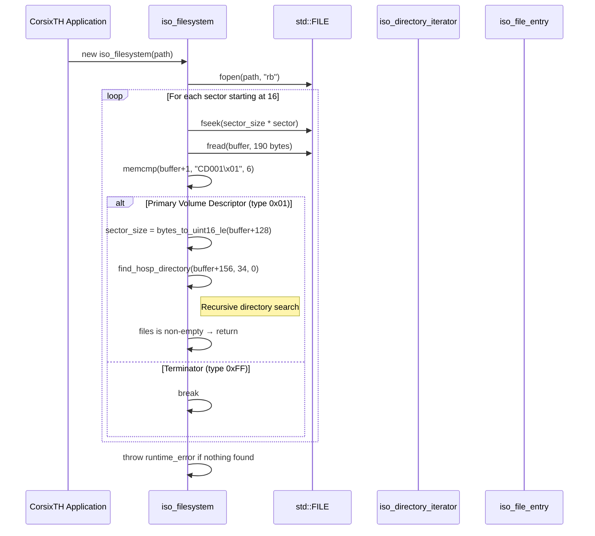
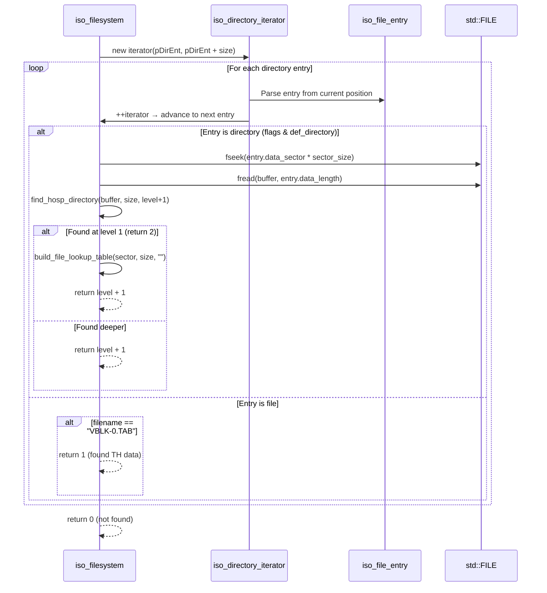
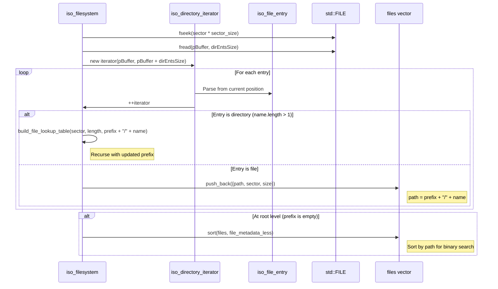
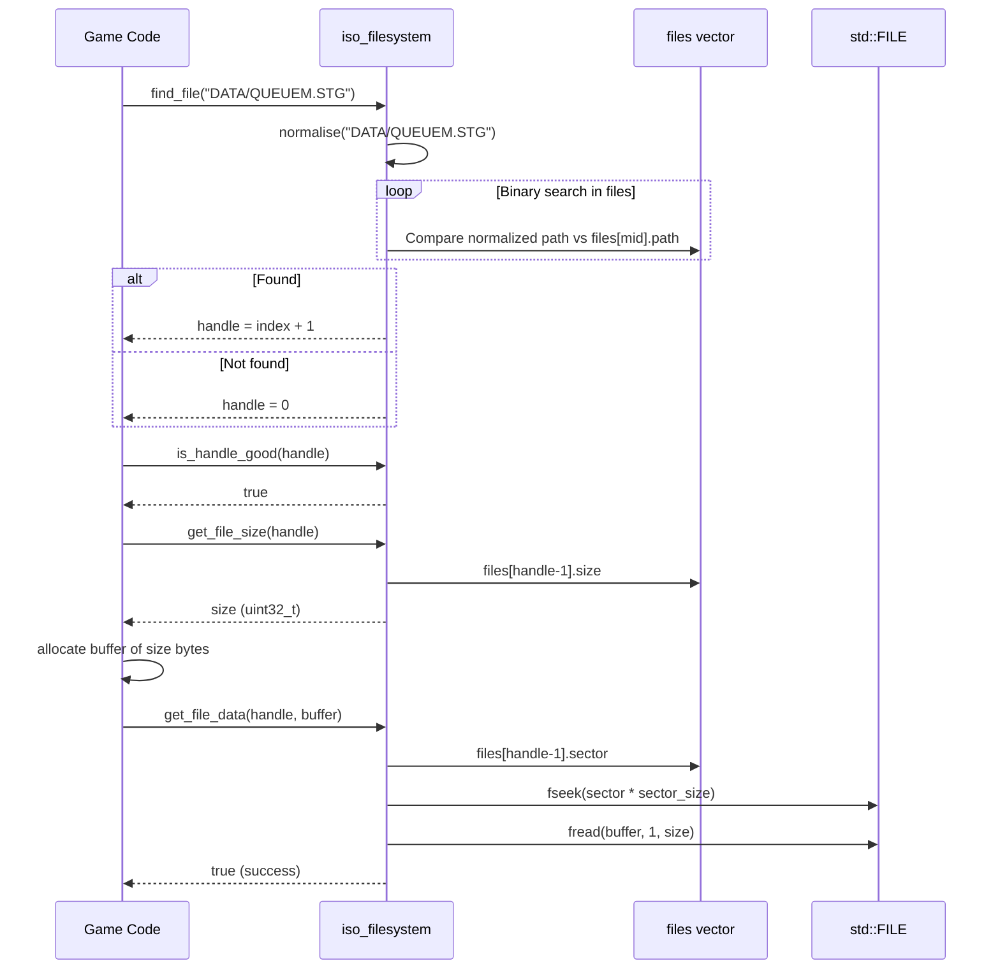
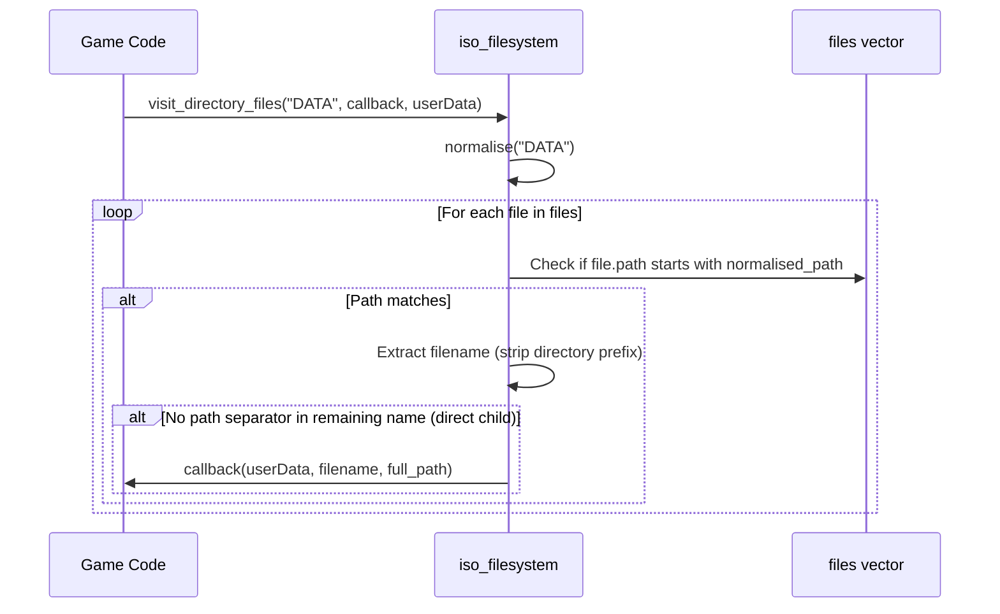
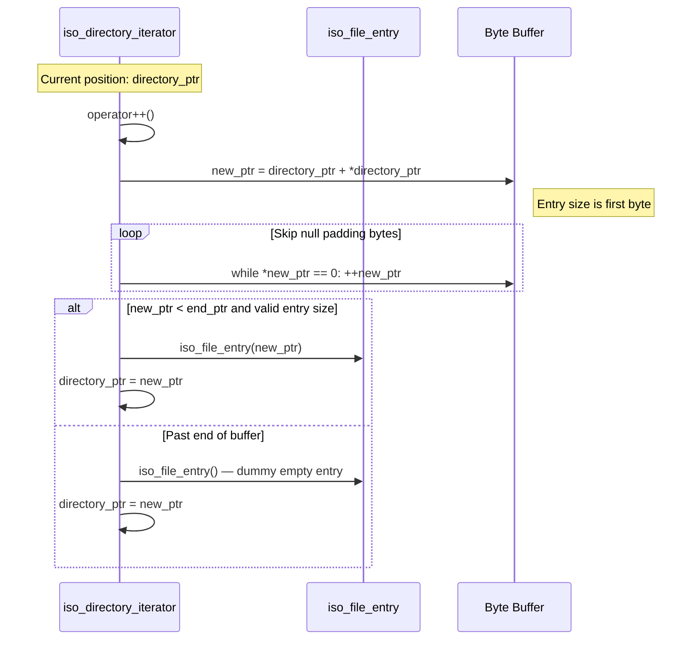

# ISO Filesystem — Sequence Diagrams

> **Mermaid sequence diagrams for key ISO filesystem operations**

## 1. ISO Filesystem Construction

---

## 2. Hospital Directory Search

---

## 3. File Lookup Table Construction

---

## 4. File Open and Read Flow

---

## 5. Directory Visit Flow

---

## 6. Iterator Advancement

---

## Related Pages

- [[SUMMARY]] — Full technical reference
- [[CLASS_DIAGRAM]] — Class hierarchy visualization
- [[MAP]] — Source file line index
- [[FORMAT_SPEC]] — ISO 9660 format specification
