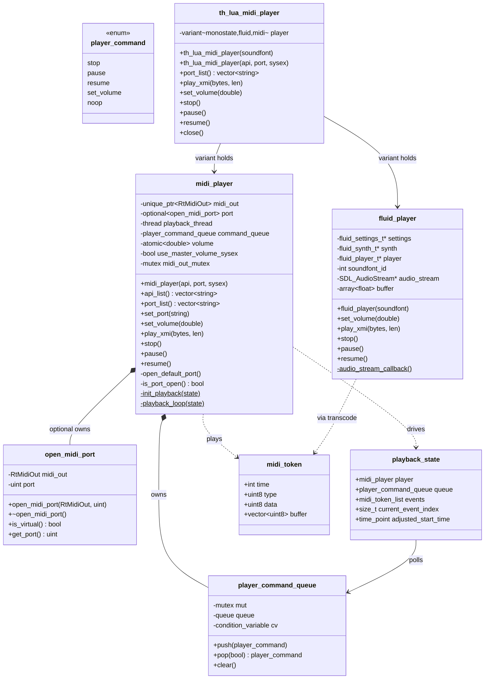

# MIDI/XMI — Class Diagram

| Relation | Note |
|---|---|
| `midi_player` → `open_midi_port` | `optional`; re-emplaced on `set_port`/default open |
| `midi_player` → thread | `stop()` joins; one song per thread lifetime |
| `th_lua_midi_player` → backends | `std::visit`; `monostate` = closed; fluid `portList` = `{}` |
