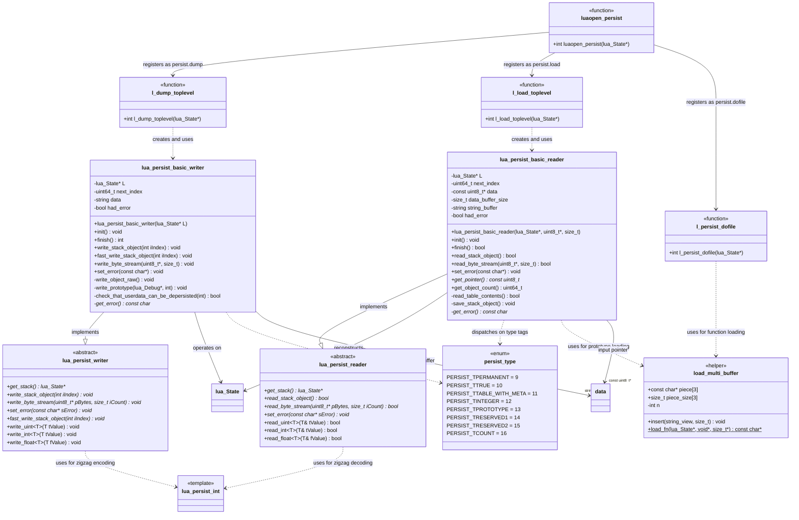

# Persistence System — Class Diagram

> **Mermaid class diagram for the CorsixTH Lua persistence subsystem**

## Relationship Summary

| Relationship | Type | Description |
|-------------|------|-------------|
| `lua_persist_basic_writer` → `lua_persist_writer` | implements | Concrete writer with Lua stack walking |
| `lua_persist_basic_reader` → `lua_persist_reader` | implements | Concrete reader with Lua stack reconstruction |
| `basic_writer` → `lua_State` | operates on | Reads Lua objects from the state |
| `basic_reader` → `lua_State` | reconstructs | Pushes deserialized objects onto the state |
| `basic_writer` → `std::string data` | owns | Binary output buffer (repurposed for errors) |
| `basic_reader` → `const uint8_t* data` | borrows | Input buffer pointer (advances during read) |
| `basic_reader` → `load_multi_buffer` | uses | Assembles function code without concatenation |
| `luaopen_persist` → writer/reader | creates | Factory for Lua-registered dump/load functions |

---

## Related Pages

- [[SUMMARY]] — Full technical reference
- [[SEQUENCE_DIAGRAM]] — Save/load sequence flows
- [[MAP]] — Source file line index
