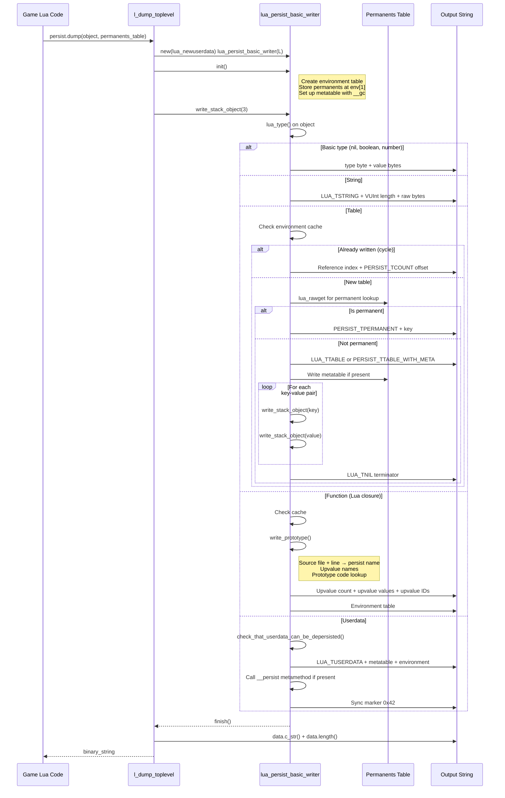
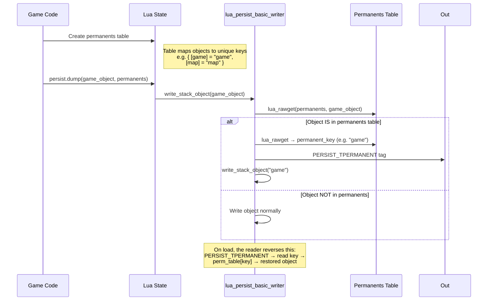
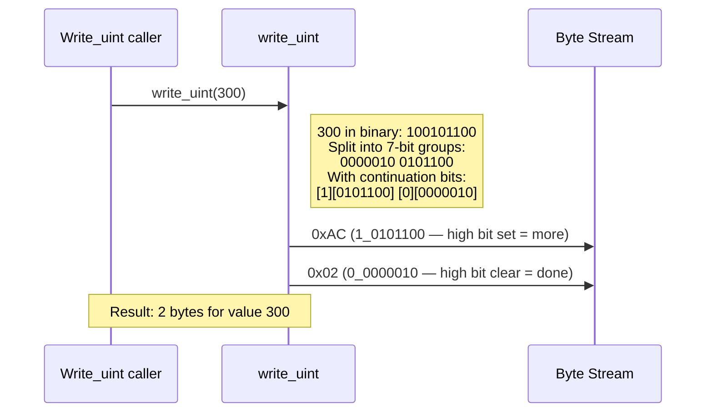

# Persistence System — Sequence Diagrams

> **Mermaid sequence diagrams for key persistence flows**

## 1. Save Game Flow (Lua State → Binary Stream)



---

## 2. Load Game Flow (Binary Stream → Lua State)

```mermaid
sequenceDiagram
    participant Lua as Game Lua Code
    participant FNS as l_load_toplevel
    participant Reader as lua_persist_basic_reader
    participant Perm as Permanents Table
    participant In as Input Buffer

    Lua->>FNS: persist.load(binary_data, permanents_table)
    FNS->>Reader: new(lua_newuserdata) lua_persist_basic_reader(L, data, len)
    FNS->>Reader: init()
    Note right of Reader: Create environment table<br/>Store permanents at env[0]<br/>Store prototype code at env[-2]<br/>Store prototype filenames at env[-1]

    FNS->>Reader: read_stack_object()
    Reader->>In: read_uint() → type tag

    switch type_tag
        case LUA_TNIL
            Reader->>Lua: lua_pushnil()
        case LUA_TBOOLEAN
            Reader->>Lua: lua_pushboolean(0)
        case PERSIST_TTRUE
            Reader->>Lua: lua_pushboolean(1)
        case LUA_TNUMBER
            Reader->>In: read_byte_stream(8 bytes)
            Reader->>Lua: lua_pushnumber(double)
        case PERSIST_TINTEGER
            Reader->>In: read_uint() → uint16
            Reader->>Lua: lua_pushinteger(value)
        case LUA_TSTRING
            Reader->>In: read_uint() → length
            Reader->>In: read_byte_stream(length)
            Reader->>Lua: lua_pushlstring()
            Reader->>Reader: save_stack_object()
        case LUA_TTABLE
            Reader->>Lua: lua_newtable()
            Reader->>Reader: save_stack_object()
            Reader->>Reader: read_table_contents()
            Note right of Reader: Loop: read key, read value<br/>lua_rawset until nil key
        case PERSIST_TTABLE_WITH_META
            Reader->>Lua: lua_newtable()
            Reader->>Reader: save_stack_object()
            Reader->>Reader: read_stack_object() → metatable
            Reader->>Lua: lua_setmetatable()
            Reader->>Reader: read_table_contents()
        case LUA_TFUNCTION
            Reader->>Reader: save_stack_object() (temp marker)
            Reader->>Reader: read_stack_object() → prototype
            Reader->>Lua: lua_call() → closure factory
            Reader->>Lua: Set upvalues from stream
            Reader->>Lua: setfenv with environment
        case LUA_TUSERDATA
            Reader->>Reader: read_stack_object() → metatable
            Reader->>Lua: lua_newuserdata(size from __depersist_size)
            Reader->>Lua: Call __pre_depersist if present
            Reader->>Lua: Set environment + metatable
            Reader->>Lua: Call __depersist(data, permanents)
            Reader->>In: Verify sync marker 0x42
        case >= PERSIST_TCOUNT
            Reader->>Reader: Lookup previously-depersisted object
            Reader->>Lua: Push from environment table
    end

    Reader->>Reader: save_stack_object()
    Reader-->>FNS: true (success)

    FNS->>Reader: finish()
    Note right of Reader: Validate all data consumed<br/>Call second-pass __depersist<br/>methods on userdata

    FNS-->>Lua: restored_object
```

---

## 3. Permanent Object Registration



---

## 4. VUInt Encoding Example



---

## 5. Prototype Depersistence

```mermaid
sequenceDiagram
    participant Reader as lua_persist_basic_reader
    participant Lua as Lua State
    participant CodeDB as Prototype Code Table
    participant FileDB as Prototype Filename Table

    Reader->>Lua: read_stack_object() → type tag PERSIST_TPROTOTYPE

    Reader->>Reader: Read upvalue count (N)
    loop For each upvalue name
        Reader->>Reader: read_stack_object() → name string
    end

    Reader->>Reader: Read persist name (e.g. "Class.method")
    Reader->>FileDB: lua_rawget(name) → filename
    Reader->>CodeDB: lua_rawget(name) → source code

    Reader->>Lua: Construct wrapper function
    Note right of Lua: "local a,b;return function(...)<br/>a,b=...end,"

    Reader->>Lua: luaT_load(code, filename)
    Note right of Lua: Compiles the wrapper<br/>Returns closure factory

    Reader->>Reader: save_stack_object() — cache the factory

    Note over Reader,Lua: Later, when this prototype is<br/>referenced again, only the<br/>cached index is written/read
```

---

## Related Pages

- [[SUMMARY]] — Full technical reference
- [[CLASS_DIAGRAM]] — Class hierarchy visualization
- [[MAP]] — Source file line index
- [[BINARY_SPEC]] — Binary format specification
