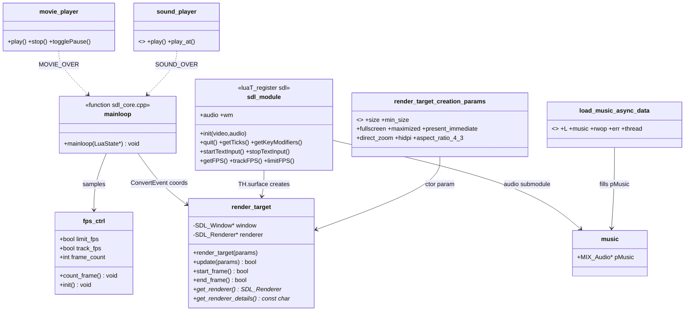

# SDL Backend — Class Diagram

| Link | Meaning |
|------|---------|
| `mainloop → render_target` | `SDL_ConvertEventToRenderCoordinates(target->get_renderer())` |
| `async_data → music` | Worker decodes, main-loop callback installs `pMusic` |
| `movie/sound → mainloop` | Custom `SDL_EVENT_USER+n` events consumed in `mainloop` |
