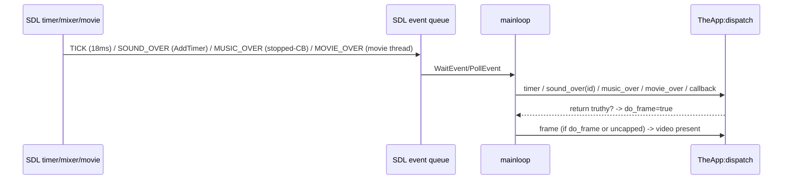

# SDL Backend — Sequence Diagram

## Startup → loop → frame → shutdown

```mermaid
sequenceDiagram
    participant OS as main SrcUnshared
    participant Boot as lua_init Src/main
    participant Lua as CorsixTH.lua
    participant SDL as sdl_core/mainloop
    participant V as render_target
    participant A as sdl_audio/music

    OS->>Boot: luaL_newstate/openlibs + pcall lua_init(argc)
    Boot->>Boot: preload sdl/TH/rnc/persist; find CorsixTH.lua
    Boot-->>Lua: loadfile + call (multret)
    Lua->>SDL: sdl.init("video","audio")
    Lua->>V: TH.surface(w,h,modes) -> CreateWindow+Renderer
    Lua->>A: sdl.audio.init(soundfont?); loadMusic/playMusic?
    OS->>SDL: mainloop(L)
    SDL->>SDL: AddTimer(18ms,timer_frame_callback)
    loop Event loop
        SDL->>SDL: WaitEvent + drain PollEvent
        SDL->>Lua: TheApp:dispatch(input/window/timer/over...)
        Lua->>V: startFrame/draw/endFrame (if do_frame)
        V->>V: fill_black + RenderPresent
    end
    SDL->>SDL: RemoveTimer; leave on QUIT
    OS->>OS: check _RESTART; destroy Lua; sound::quit; MIX_Quit; SDL_Quit
```

## Timer + custom-event detail


