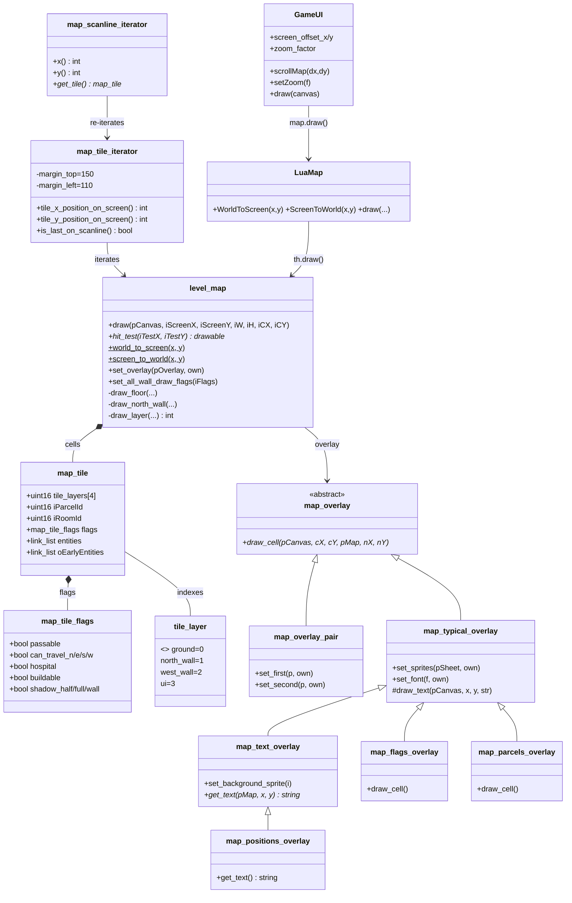

# World-to-Screen — Class Diagram

## Related Pages

- [[world-to-screen/SUMMARY]] — overview
- [[world-to-screen/MAP]] — file:line index
- [[world-to-screen/SEQUENCE_DIAGRAM]] — flow
- [[world-to-screen/SPEC]] — math + flags
