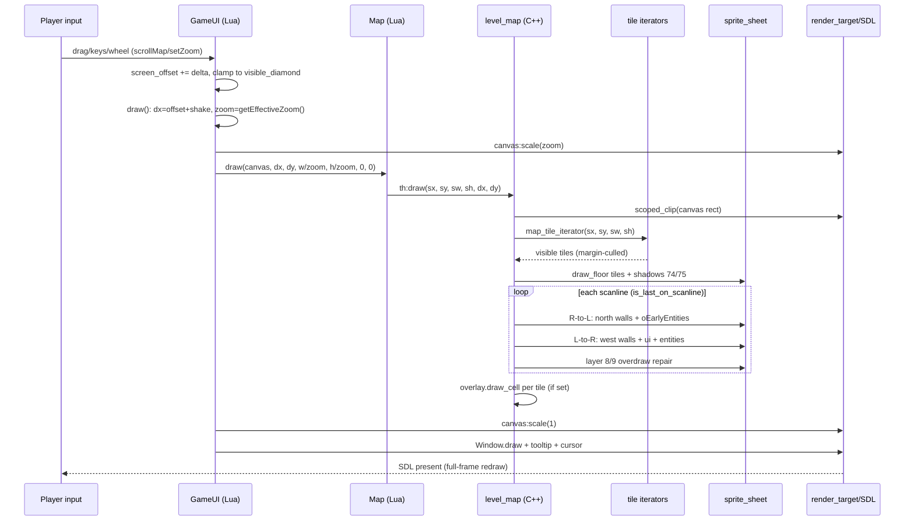

# World-to-Screen — Sequence Diagram

## Camera move → tile draw → present

## Notes

- No dirty-rect messages exist; culling = iterator margins + canvas clip.
- Zoom never enters C++; Lua pre-divides `w/zoom` and scales the target.
- Hit test (`hitTestObjects`) is the draw order reversed, not shown.

## Related Pages

- [[world-to-screen/SUMMARY]] — overview
- [[world-to-screen/CLASS_DIAGRAM]] — classes
- [[world-to-screen/MAP]] — line index
- [[world-to-screen/SPEC]] — math + flags
