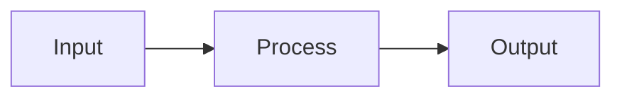

# {{subsystem_name}} - Subsystem Study

## Overview
Brief description of this subsystem.

## Key Files
| File | Lines | Purpose |
|------|-------|---------|
|  |  |  |

## Architecture
> [!NOTE] Key Pattern

## Data Flow

## Key Invariants
1. 

## Edge Cases
- 

## Design Principles
1. 

## Related Pages
- [[02-SUBSYSTEMS/{{subsystem_name}}/MAP]]
- [[02-SUBSYSTEMS/{{subsystem_name}}/SUMMARY]]
