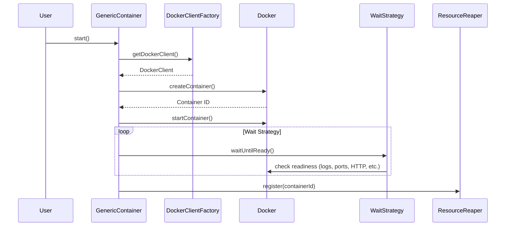

# Java Architecture Index

> testcontainers-java — 8.7k★ · Gradle · Java 17 · 60+ modules

---

## 1. Project Overview

| Aspect | Detail |
|--------|--------|
| Repository | [testcontainers/testcontainers-java](https://github.com/testcontainers/testcontainers-java) |
| Build System | Gradle (wrapper) |
| Language | Java 17 (toolchain) |
| Formatter | Spotless (requires Node.js/npm) |
| Linter | Checkstyle (NeedBraces, Javadoc, etc.) |
| Test Framework | JUnit 4/5, Spock |
| Modules | 60+ (databases, messaging, cloud, web, specialized) |

---

## 2. Repository Structure

```
testcontainers-java/
├── core/                          # Core library
│   └── src/main/java/org/testcontainers/
│       ├── containers/            # GenericContainer, ComposeContainer, etc.
│       ├── core/                  # WaitStrategy, ContainerState
│       ├── dockerclient/          # DockerClientFactory
│       ├── images/                # RemoteDockerImage, LocalDockerImage
│       ├── lifecycle/             # ResourceReaper (Ryuk)
│       ├── utility/               # DockerLoggerFactory, etc.
│       └── jib/                   # Jib integration
├── modules/                       # 60+ module implementations
│   ├── databases/                 # PostgreSQL, MySQL, MongoDB, etc.
│   ├── messaging/                 # Kafka, RabbitMQ, Redis, etc.
│   ├── cloud/                     # LocalStack, GCloud, Azure
│   ├── web/                       # Selenium, Webdriver
│   └── specialized/               # Toxiproxy, Vault, etc.
├── docs/                          # MkDocs + Material + codeinclude
├── examples/                      # Runnable examples
└── build.gradle                   # Gradle config (Java 17 toolchain)
```

---

## 3. Technology Stack

| Component | Version/Tool |
|-----------|--------------|
| Java | 17 (toolchain, release 8 target) |
| Build | Gradle 8.x (wrapper) |
| Formatting | Spotless (Google Java Format + Prettier) |
| Linting | Checkstyle (NeedBraces, Javadoc, etc.) |
| Docker Client | docker-java (via DockerClientFactory) |
| Logging | SLF4J 1.7.x (no lambda support) |
| Testing | JUnit 4/5, Spock, Testcontainers self-testing |

---

## 3. System Architecture

```mermaid
graph TD
    subgraph Core["Core (testcontainers)"]
        GC[GenericContainer<br/>start(), tryStart(), stop()]
        DCF[DockerClientFactory<br/>getDockerClient(), createDockerClient()]
        RR[ResourceReaper<br/>start(), stop(), register()]
        WS[WaitStrategy<br/>waitUntilReady()]
        CI[ContainerState<br/>getHost(), getMappedPort()]
    end

    subgraph Modules["Modules (60+)"]["Modules (60+)"]
        DB[Databases<br/>PostgreSQL, MySQL, MongoDB...]
        MQ[Message Queues<br/>Kafka, RabbitMQ, Redis...]
        CI_MOD[Cloud/Infra<br/>LocalStack, GCloud, Azure...]
        SP[Specialized<br/>Toxiproxy, Selenium, Vault...]
    end

    GC --> DCF
    GC --> RR
    GC --> WS
    GC --> Modules
    GC --> CI
    WS -.-> GC
    RR -.-> GC
```

**Key Methods Shown:**
- `GenericContainer.start()` — entry point, calls `tryStart()`
- `GenericContainer.tryStart()` — resolves image, creates container, applies wait strategy
- `DockerClientFactory.getDockerClient()` — singleton Docker client
- `ResourceReaper.start()` — starts Ryuk container for cleanup
- `WaitStrategy.waitUntilReady()` — polls until container ready

---

## 4. Core Components

| Component | File | Key Methods | Responsibility |
|-----------|------|-------------|----------------|
| `GenericContainer` | `containers/GenericContainer.java` | `start()`, `tryStart()`, `stop()`, `getMappedPort()` | Main container abstraction |
| `DockerClientFactory` | `dockerclient/DockerClientFactory.java` | `getDockerClient()`, `instance()` | Singleton Docker client |
| `ResourceReaper` | `lifecycle/ResourceReaper.java` | `start()`, `stop()`, `register()` | Ryuk-based cleanup |
| `WaitStrategy` | `core/WaitStrategy.java` | `waitUntilReady()` | Readiness polling |
| `ContainerState` | `containers/ContainerState.java` | `getHost()`, `getMappedPort()` | Runtime container info |
| `DockerClientFactory` | `dockerclient/DockerClientFactory.java` | `getDockerClient()` | Thread-safe Docker client |
| `RemoteDockerImage` | `images/RemoteDockerImage.java` | `resolve()` | Image pulling & resolution |
| `DockerLoggerFactory` | `utility/DockerLoggerFactory.java` | `getLogger()` | Per-container loggers |

---

## 5. Module System

### Module Categories (60+ modules)

| Category | Count | Examples |
|----------|-------|----------|
| Databases (SQL) | 15+ | PostgreSQL, MySQL, MariaDB, Oracle, SQL Server, CockroachDB, ClickHouse, CrateDB, etc. |
| Databases (NoSQL) | 8+ | MongoDB, Cassandra, Redis, Couchbase, CouchDB, InfluxDB, Neo4j, Cassandra |
| Message Queues | 6+ | Kafka, RabbitMQ, Pulsar, Redpanda, Solace, ActiveMQ |
| Cloud/Infra | 8+ | LocalStack, GCloud, Azure, Vault, Consul, K3s, Ollama, Ollama |
| Search/Analytics | 5+ | Elasticsearch, OpenSearch, ClickHouse, QuestDB, Trino |
| Web/UI | 3+ | Selenium, Webdriver, VncRecording |
| Specialized | 10+ | Toxiproxy, MockServer, Mockserver, WireMock, Testcontainers MCP Gateway |

### Module Structure (Typical)

```
modules/mysql/
├── src/main/java/org/testcontainers/containers/
│   └── MySQLContainer.java          # Extends JdbcDatabaseContainer
├── src/test/java/                   # Module tests
├── build.gradle                     # Module dependencies
└── src/main/resources/              # SQL init scripts, config
```

---

## 6. Data Flow



---

## 7. Runtime Flow

```mermaid
flowchart TD
    A[User calls container.start()] --> B[GenericContainer.start()]
    B --> C{waitStrategy != DEFAULT?}
    C -->|Yes| D[Set custom WaitStrategy]
    C -->|No| E[Use DEFAULT_WAIT_STRATEGY]
    D --> F[tryStart()]
    E --> F
    F --> G[configure() - ports, env, mounts]
    F --> G
    G --> H[dockerClient.createContainer()]
    H --> I[dockerClient.startContainer()]
    I --> J[waitStrategy.waitUntilReady()]
    J --> K[ResourceReaper.register()]
    K --> L[Return Container]
```

**Key Methods:**
- `GenericContainer.start()` — lines 320-330
- `GenericContainer.tryStart()` — lines 360-420
- `GenericContainer.configure()` — lines 430-550
- `waitStrategy.waitUntilReady()` — implemented by concrete strategies

---

## 8. Key Interfaces & Abstractions

| Interface/Class | Purpose | Implementations |
|-----------------|---------|-----------------|
| `WaitStrategy` | Readiness polling | `LogMessageWaitStrategy`, `HttpWaitStrategy`, `PortWaitStrategy`, `HostPortWaitStrategy` |
| `DockerClient` | Docker API wrapper | `DockerClientImpl` (docker-java) |
| `Container` | Container lifecycle | `GenericContainer`, `ComposeContainer`, `Network` |
| `Image` | Image resolution | `RemoteDockerImage`, `LocalDockerImage` |
| `LogConsumer` | Log consumption | `Slf4jLogConsumer`, `Consumer` |
| `ContainerState` | Runtime state access | `ContainerState` |

---

## 9. Dependency Map

```
testcontainers-java
├── core (testcontainers)
│   ├── docker-java (provided)
│   ├── slf4j-api (provided)
│   └── junit-jupiter (test)
├── modules/*
│   └── core (compile)
├── junit-jupiter (extension)
├── spock (extension)
└── examples/*
    └── modules/* (runtime)
```

---

## 9. Key Links

- [Contributing Guide](https://java.testcontainers.org/contributing/)
- [Documentation Guide](https://java.testcontainers.org/contributing_docs/)
- [Javadoc](https://www.javadoc.io/doc/org.testcontainers/testcontainers/latest)
- [Modules Documentation](https://java.testcontainers.org/modules/)
- [Examples](https://github.com/testcontainers/testcontainers-java/tree/main/examples)