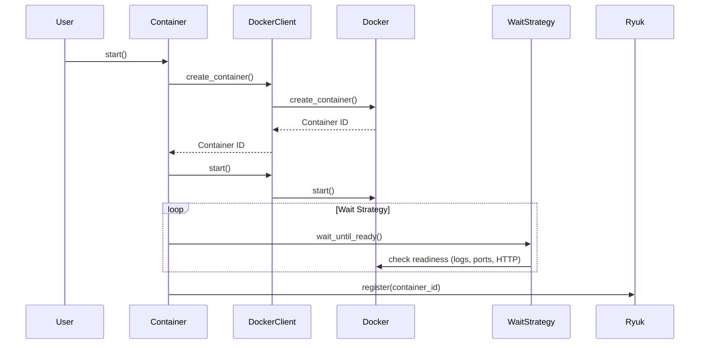

# Python Architecture Index

> testcontainers-python — 2.3k★ · uv + Make · Python 3.8+ · uv package manager

---

## 1. Project Overview

| Aspect | Detail |
|--------|--------|
| Repository | [testcontainers/testcontainers-python](https://github.com/testcontainers/testcontainers-python) |
| Build System | Make + uv (primary package manager) |
| Language | Python 3.8+ |
| Package Manager | uv (modern Python package manager) |
| Task Runner | Make |
| Formatter/Linter | pre-commit / ruff |
| Documentation | MkDocs + Material + codeinclude plugin |
| Release | Automated via release-please |
| Test Framework | pytest (core + community modules) |

---

## 2. Repository Structure

```
testcontainers-python/
├── src/
│   └── testcontainers/              # Main package
│       ├── __init__.py
│       ├── core/                    # Core abstractions
│       │   ├── __init__.py
│       │   ├── config.py            # Configuration (testcontainers_config)
│       │   ├── container.py         # Container class (core abstraction)
│       │   ├── docker_client.py     # DockerClient wrapper
│       │   ├── wait_strategy.py     # WaitStrategy base class
│       │   └── utils.py
│       ├── modules/                 # All modules in same repo
│       │   ├── __init__.py
│       │   ├── postgres.py          # PostgresContainer
│       │   ├── mysql.py             # MySqlContainer
│       │   ├── mongo.py             # MongoDbContainer
│       │   ├── redis.py             # RedisContainer
│       │   ├── kafka.py             # KafkaContainer
│       │   ├── elasticsearch.py     # ElasticSearchContainer
│       │   ├── localstack.py        # LocalStackContainer
│       │   ├── clickhouse.py        # ClickHouseContainer
│       │   ├── cassandra.py         # CassandraContainer
│       │   ├── minio.py             # MinIOContainer
│       │   └── ...                  # 30+ modules
│       └── utils.py
├── tests/
│   ├── core/                        # Core tests
│   └── community/                   # Module tests (per module)
├── docs/
│   ├── modules/                     # Module documentation
│   ├── contributing.md
│   └── mkdocs.yml
├── doctests/                        # Documentation tests
├── scripts/                         # Utility scripts
├── Makefile                         # Task runner
├── pyproject.toml                   # Project config (uv)
├── uv.lock                          # Lock file
├── mkdocs.yml                       # MkDocs config
├── .pre-commit-config.yaml          # Pre-commit hooks
├── README.md
└── CHANGELOG.md
```

---

## 2. Technology Stack

| Component | Version/Tool |
|-----------|--------------|
| Python | 3.8+ |
| Package Manager | uv (Astral) |
| Task Runner | Make |
| Formatter/Linter | ruff (via pre-commit) |
| Documentation | MkDocs + Material + codeinclude |
| Release Automation | release-please (GitHub Actions) |
| Test Runner | pytest |
| Docker Client | docker-py (official Python Docker SDK) |
| Release Automation | release-please (GitHub Actions) |

---

## 3. System Architecture

```mermaid
graph TD
    subgraph Core["testcontainers package"]
        CC[Container<br/>start(), stop(), exec(), get_connection_url()]
        DC[DockerClient<br/>create_container(), start(), stop()]
        WS[WaitStrategy<br/>wait_until_ready()]
        TC[testcontainers_config<br/>ryuk_docker_socket, etc.]
    end

    subgraph Modules["Modules (30+)"]["Modules (30+)"]
        DB[Databases<br/>PostgresContainer, MySqlContainer...]
        MQ[Message Queues<br/>KafkaContainer, RabbitMqContainer...]
        CI[Cloud/Infra<br/>LocalStackContainer, GCloudContainer...]
        SP[Specialized<br/>ClickHouse, Elasticsearch...]
    end

    CC --> DC
    CC --> TC
    CC --> WS
    CC --> Modules
    DC -.-> CC
    TC -.-> DC
    WS -.-> CC
```

**Key Methods Shown:**
- `Container.start()` — entry point, creates container, applies wait strategy
- `DockerClient.create_container()` — wraps docker-py create_container
- `WaitStrategy.wait_until_ready()` — polls until container ready
- `testcontainers_config` — global configuration object

---

## 4. Core Components

| Component | File | Key Methods | Responsibility |
|-----------|------|-------------|----------------|
| `Container` | `core/container.py` | `start()`, `stop()`, `exec()`, `get_connection_url()`, `get_container_host_ip()` | Core container abstraction |
| `DockerClient` | `core/docker_client.py` | `create_container()`, `start()`, `stop()`, `exec_run()` | Wrapper around docker-py |
| `WaitStrategy` | `core/wait_strategy.py` | `wait_until_ready()` | Readiness strategies |
| `DockerClient` (singleton) | `core/docker_client.py` | `get_docker_client()` | docker-py wrapper |
| `testcontainers_config` | `core/config.py` | `ryuk_docker_socket`, `ryuk_disabled` | Global config |
| `PostgresContainer` | `modules/postgres.py` | `get_connection_url()` | PostgreSQL-specific |
| `GenericContainer` | `core/container.py` | `with_env()`, `with_bind_ports()` | Generic container builder |

---

## 4. Core Classes & Methods

| Class | File | Key Methods | Purpose |
|-------|------|-------------|---------|
| `Container` | `core/container.py` | `start()`, `stop()`, `exec()`, `get_connection_url()` | Core container |
| `DockerClient` | `core/docker_client.py` | `create_container()`, `start()`, `exec_run()` | docker-py wrapper |
| `WaitStrategy` | `core/wait_strategy.py` | `wait_until_ready()` | Readiness strategies |
| `PostgresContainer` | `modules/postgres.py` | `get_connection_url()`, `get_driver()` | PostgreSQL-specific |
| `MySqlContainer` | `modules/mysql.py` | `get_connection_url()` | MySQL-specific |
| `GenericContainer` | `core/container.py` | `with_env()`, `with_bind_ports()` | Generic builder |

---

## 5. Module System

### All Modules in Same Repo (Core + Community)

| Category | Count | Examples |
|----------|-------|----------|
| Databases (SQL) | 10+ | PostgreSQL, MySQL, MariaDB, Oracle, ClickHouse, CockroachDB, CrateDB, etc. |
| Databases (NoSQL) | 5+ | MongoDB, Redis, Cassandra, Elasticsearch, Cassandra |
| Message Queues | 4+ | Kafka, RabbitMQ, Redis, Pulsar |
| Cloud/Infra | 4+ | LocalStack, GCloud, Azure, MinIO |
| Search/Analytics | 3+ | Elasticsearch, ClickHouse, QuestDB |
| Specialized | 5+ | Toxiproxy, Vault, MinIO, Selenium, Ollama |

### Module Structure (Typical)

```
src/testcontainers/modules/postgres.py
├── class PostgresContainer(Container):
│   def __init__(self, image="postgres:16", **kwargs)
│   def get_connection_url(self) -> str
│   def get_driver(self) -> str
│   def get_connection_url(self) -> str
```

---

## 6. Data Flow



---

## 5. Runtime Flow

```mermaid
flowchart TD
    A[User calls container.start()] --> B[Container.start()]
    B --> C[DockerClient.create_container()]
    C --> D[docker-py: create_container()]
    D --> E[DockerClient.start()]
    E --> F[docker-py: start()]
    F --> G[WaitStrategy.wait_until_ready()]
    G --> H[Check readiness (logs, ports, HTTP)]
    H --> G
    G -->|Ready| I[Register with Ryuk]
    I --> J[Return self]
```

**Key Methods:**
- `Container.start()` — `core/container.py` lines 150-250
- `DockerClient.create_container()` — `core/docker_client.py` lines 50-120
- `WaitStrategy.wait_until_ready()` — various implementations
- `testcontainers_config` — `core/config.py` global config

---

## 5. Key Classes & Abstractions

| Class | File | Key Methods | Purpose |
|-------|------|-------------|---------|
| `Container` | `core/container.py` | `start()`, `stop()`, `exec()`, `get_connection_url()` | Core container |
| `DockerClient` | `core/docker_client.py` | `create_container()`, `start()`, `exec_run()` | docker-py wrapper |
| `WaitStrategy` | `core/wait_strategy.py` | `wait_until_ready()` | Readiness strategies |
| `PostgresContainer` | `modules/postgres.py` | `get_connection_url()`, `get_driver()` | PostgreSQL-specific |
| `GenericContainer` | `core/container.py` | `with_env()`, `with_bind_ports()` | Generic builder |
| `testcontainers_config` | `core/config.py` | `ryuk_docker_socket`, `ryuk_disabled` | Global config |

---

## 5. Wait Strategies

| Strategy | Class | Description |
|----------|-------|-------------|
| Log Message | `LogMessageWaitStrategy` | Wait for stdout/stderr message |
| Port Listening | `PortWaitStrategy` | Wait for TCP port |
| HTTP Endpoint | `HttpWaitStrategy` | Wait for HTTP 200 |
| Custom | Custom callable | Custom predicate |

---

## 6. Dependency Map

```
testcontainers
├── docker-py (Docker API)
├── pydantic (config)
├── pytest (testing)
├── ruff (linting)
├── pre-commit (hooks)
├── mkdocs + material (docs)
├── release-please (release automation)
└── ryuk (cleanup)
```

---

## 8. Key Links

- [Contributing Guide](https://github.com/testcontainers/testcontainers-python/blob/main/docs/contributing.md)
- [Python Docs](https://testcontainers-python.readthedocs.io)
- [PyPI Package](https://pypi.org/project/testcontainers/)
- [Release Process](https://github.com/testcontainers/testcontainers-python/blob/main/.github/workflows/release-please.yml)
- [Makefile](https://github.com/testcontainers/testcontainers-python/blob/main/Makefile)