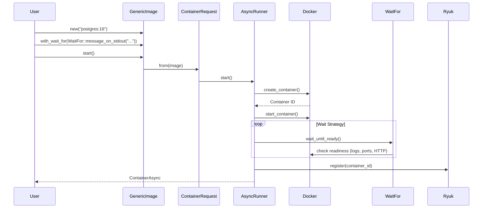

# Rust Architecture Index

> testcontainers-rs — 1.1k★ · Cargo workspace · Rust 1.85+ · tokio · bollard

---

## 1. Project Overview

| Aspect | Detail |
|--------|--------|
| Repository | [testcontainers/testcontainers-rs](https://github.com/testcontainers/testcontainers-rs) |
| Build System | Cargo workspace |
| Language | Rust 1.85+ (stable + nightly for fmt) |
| Async Runtime | tokio |
| Docker Client | bollard |
| Formatter | rustfmt (nightly) |
| Linter | clippy |
| Test Framework | Built-in + tokio::test |
| Core Modules Only | This index covers `testcontainers/src/` only (not community modules) |

---

## 2. Repository Structure

```
testcontainers-rs/
├── testcontainers/              # Core crate (this index)
│   ├── src/
│   │   ├── lib.rs               # Public API exports
│   │   ├── core.rs              # Re-exports & core traits
│   │   ├── core/                # Core types & traits
│   │   │   ├── image.rs         # Image trait, GenericImage
│   │   │   ├── wait.rs          # WaitFor trait, strategies
│   │   │   ├── container.rs     # ContainerAsync, ContainerRequest
│   │   │   ├── client.rs        # DockerClient wrapper (bollard)
│   │   │   ├── network.rs       # Network management
│   │   │   ├── ports.rs         # Port mapping
│   │   │   ├── mounts.rs        # Volume/mount handling
│   │   │   ├── healthcheck.rs   # Health check support
│   │   │   ├── logs.rs          # LogConsumer trait
│   │   │   ├── env.rs           # Environment variables
│   │   │   ├── mounts.rs        # Mount handling
│   │   │   ├── ports.rs         # Port mappings
│   │   │   ├── healthcheck.rs   # Health checks
│   │   │   ├── error.rs         # Error types
│   │   │   ├── copy.rs          # File copy operations
│   │   │   ├── async_drop.rs    # Async drop implementation
│   │   │   └── mod.rs
│   │   ├── runners/             # Async & blocking runners
│   │   │   ├── async_runner.rs
│   │   │   ├── sync_runner.rs
│   │   │   ├── async_builder.rs
│   │   │   └── sync_builder.rs
│   │   ├── buildables/          # Image building
│   │   │   └── generic.rs
│   │   ├── compose/             # Docker Compose support
│   │   ├── images/              # Predefined images
│   │   └── testcontainers.rs    # Test utilities
│   ├── Cargo.toml
│   └── Cargo.lock
├── testcontainers-modules-community/  # Community modules (separate repo)
├── testimages/                  # Test images for integration tests
├── docs/                        # MkDocs documentation
├── Cargo.toml                   # Workspace root
└── Cargo.lock
```

---

## 2. Technology Stack

| Component | Version/Tool |
|-----------|--------------|
| Rust | 1.85+ (stable + nightly for fmt) |
| Build | Cargo (workspace) |
| Async Runtime | tokio (full) |
| Docker Client | bollard (async Docker API) |
| Serialization | serde (derive) |
| Async Traits | async-trait |
| Formatting | rustfmt (nightly) |
| Linting | clippy |
| Testing | tokio::test, built-in test harness |
| Test Images | testimages/ (custom test images) |

---

## 3. System Architecture

```mermaid
graph TD
    subgraph Core["testcontainers crate"]
        GI[GenericImage<br/>new(), with_wait_for(), start()]
        CI[ContainerAsync<br/>start(), stop(), exec(), logs()]
        CR[ContainerRequest<br/>with_*, builder pattern]
        CT[ContainerAsync::start()<br/>creates container]
        WT[WaitFor<br/>wait_until_ready()]
        LC[LogConsumer<br/>accept()]
    end

    subgraph Runners["Runners"]
        AR[AsyncRunner<br/>start(), run()]
        SR[SyncRunner<br/>start(), run()]
        AB[AsyncBuilder<br/>with_*(), start()]
        SB[SyncBuilder<br/>with_*(), start()]
    end

    subgraph Core["Core Types"]
        IM[Image<br/>name(), tag(), env_vars(), cmd()]
        WF[WaitFor<br/>wait_until_ready()]
        LC[LogConsumer<br/>accept()]
        CT[ContainerAsync<br/>start(), stop(), exec(), logs(), get_host_port()]
        CR[ContainerRequest<br/>builder pattern]
    end

    Core --> Runners
    Core --> GI
    GI --> CR
    CR --> Runners
    Runners --> CT
    CT --> WF
    CT --> LC
```

**Key Methods Shown:**
- `GenericImage::new()` — create new image
- `GenericImage::start()` — returns `ContainerAsync`
- `ContainerAsync::start()` — creates and starts container
- `WaitFor::wait_until_ready()` — async readiness check
- `AsyncRunner::start()` — async container lifecycle

---

## 3. System Architecture (Detailed)

```mermaid
graph TD
    subgraph API["Public API"]
        GI[GenericImage<br/>new(), with_wait_for(), with_env_var(), start()]
        GI2[GenericBuildableImage<br/>with_dockerfile(), build()]
    end

    subgraph Builders["Builders"]
        CB[ContainerRequest<br/>builder pattern<br/>with_*(), build()]
        AB[AsyncBuilder<br/>with_*(), start()]
        SB[SyncBuilder<br/>with_*(), start()]
    end

    subgraph Runners["Runners"]
        AR[AsyncRunner<br/>start() -> ContainerAsync]
        SR[SyncRunner<br/>start() -> Container]
    end

    subgraph Core["Core Types"]
        IM[Image<br/>name(), tag(), env_vars(), cmd(), wait_for()]
        CT[ContainerAsync<br/>start(), stop(), exec(), logs(), get_host_port()]
        WF[WaitFor<br/>wait_until_ready()]
        LC[LogConsumer<br/>accept()]
        CR[ContainerRequest<br/>image, cmd, env, ports, ...]
    end

    subgraph External["External"]
        DOCKER[Docker API<br/>via bollard]
        RYUK[Ryuk<br/>cleanup]
    end

    API --> Builders
    Builders --> Runners
    Runners --> Core
    Core --> DOCKER
    Core -.-> RYUK
```

**Key Methods Shown:**
- `GenericImage::new()` / `GenericImage::start()` — entry point
- `AsyncRunner::start()` → `ContainerAsync` — async container lifecycle
- `ContainerAsync::start()` → creates Docker container via bollard
- `WaitFor::wait_until_ready()` — async readiness polling
- `ContainerAsync::exec()` — execute commands in running container

---

## 4. Core Components

| Component | File | Key Methods | Responsibility |
|-----------|------|-------------|----------------|
| `GenericImage` | `core/image.rs` | `new()`, `with_wait_for()`, `with_env_var()`, `start()` | Main image abstraction |
| `GenericBuildableImage` | `buildables/generic.rs` | `with_dockerfile()`, `build()` | Build images from Dockerfile |
| `ContainerRequest` | `core/containers/request.rs` | Builder pattern: `with_*()` | Container configuration |
| `ContainerAsync` | `core/containers/async_container.rs` | `start()`, `stop()`, `exec()`, `logs()`, `get_host_port()` | Running container |
| `Container` | `core/containers/sync_container.rs` | `start()`, `stop()`, `exec()`, `logs()` | Blocking wrapper |
| `AsyncRunner` | `runners/async_runner.rs` | `start()` → `ContainerAsync` | Async container lifecycle |
| `SyncRunner` | `runners/sync_runner.rs` | `start()` → `Container` | Blocking container lifecycle |
| `WaitFor` | `core/wait.rs` | `wait_until_ready()` | Readiness strategies |
| `LogConsumer` | `core/logs.rs` | `accept()` | Log consumption |
| `Image` trait | `core/image.rs` | `name()`, `tag()`, `env_vars()`, `cmd()` | Image abstraction |

---

## 4. Core Types & Traits

| Trait/Struct | File | Key Methods | Purpose |
|--------------|------|-------------|---------|
| `Image` (trait) | `core/image.rs` | `name()`, `tag()`, `env_vars()`, `cmd()`, `wait_for()` | Image abstraction |
| `GenericImage` | `core/image.rs` | `new()`, `with_wait_for()`, `with_env_var()`, `start()` | Concrete image |
| `GenericBuildableImage` | `buildables/generic.rs` | `with_dockerfile()`, `build()` | Build from Dockerfile |
| `ContainerRequest` | `core/containers/request.rs` | Builder: `with_*()` | Container config |
| `ContainerAsync` | `core/containers/async_container.rs` | `start()`, `stop()`, `exec()`, `logs()`, `get_host_port()` | Async container |
| `Container` | `core/containers/sync_container.rs` | `start()`, `stop()`, `exec()`, `logs()` | Blocking container |
| `AsyncRunner` | `runners/async_runner.rs` | `start()` | Async runner |
| `SyncRunner` | `runners/sync_runner.rs` | `start()` | Blocking runner |
| `WaitFor` | `core/wait.rs` | `wait_until_ready()` | Readiness strategies |
| `LogConsumer` | `core/logs.rs` | `accept()` | Log consumption |

---

## 5. Module System

### Core Modules Only (This Index)

| Module | Location | Description |
|--------|----------|-------------|
| `generic` | `images/generic.rs` | GenericImage, GenericBuildableImage |
| `postgres` | `images/postgres.rs` | PostgresImage |
| `redis` | `images/redis.rs` | RedisImage |
| `mysql` | `images/mysql.rs` | MySqlImage |
| `kafka` | `images/kafka.rs` | KafkaImage |
| `redis` | `images/redis.rs` | RedisImage |
| `localstack` | `images/localstack.rs` | LocalStackImage |

### Community Modules (Separate Repo)

```
testcontainers-modules-community/
├── modules/
│   ├── elasticsearch/
│   ├── mongodb/
│   ├── clickhouse/
│   ├── cassandra/
│   ├── couchbase/
│   ├── neo4j/
│   ├── vault/
│   └── ... (50+ modules)
```

> **Note:** This index covers only `testcontainers/src/` (core crate). Community modules are in a separate repository: `testcontainers/testcontainers-rs-modules-community`.

---

## 6. Data Flow



---

## 5. Runtime Flow

```mermaid
flowchart TD
    A[User calls image.start()] --> B[GenericImage::start()]
    B --> C[ContainerRequest::from(image)]
    C --> D[AsyncRunner::start(request)]
    D --> E[AsyncRunner::create_container()]
    E --> F[Docker: create_container()]
    F --> G[Docker: start_container()]
    G --> H[Runner::wait_until_ready()]
    H --> I[WaitFor::wait_until_ready()]
    I --> J[Docker: check readiness]
    J --> I
    I -->|Ready| K[Register with Ryuk]
    K --> L[Return ContainerAsync]
```

**Key Methods:**
- `GenericImage::start()` — `images/image.rs` lines 150-180
- `AsyncRunner::start()` — `runners/async_runner.rs` lines 50-120
- `AsyncRunner::create_container()` — lines 200-300
- `WaitFor::wait_until_ready()` — `core/wait.rs` various implementations
- `ContainerAsync::start()` — `core/containers/async_container.rs`

---

## 5. Key Traits & Abstractions

| Trait/Struct | File | Key Methods | Purpose |
|--------------|------|-------------|---------|
| `Image` (trait) | `core/image.rs` | `name()`, `tag()`, `env_vars()`, `cmd()`, `wait_for()` | Image abstraction |
| `GenericImage` | `core/image.rs` | `new()`, `with_wait_for()`, `with_env_var()`, `start()` | Concrete image |
| `ContainerRequest` | `core/containers/request.rs` | Builder: `with_*()` | Container config |
| `ContainerAsync` | `core/containers/async_container.rs` | `start()`, `stop()`, `exec()`, `logs()`, `get_host_port()` | Async container |
| `Container` | `core/containers/sync_container.rs` | `start()`, `stop()`, `exec()`, `logs()` | Blocking container |
| `AsyncRunner` | `runners/async_runner.rs` | `start()` | Async runner |
| `SyncRunner` | `runners/sync_runner.rs` | `start()` | Blocking runner |
| `WaitFor` | `core/wait.rs` | `wait_until_ready()` | Readiness strategies |
| `LogConsumer` | `core/logs.rs` | `accept()` | Log consumption |

---

## 5. Wait Strategies (WaitFor Enum)

| Strategy | Variant | Description |
|----------|---------|-------------|
| Message on Stdout | `WaitFor::message_on_stdout(msg)` | Wait for log message |
| Message on Stderr | `WaitFor::message_on_stderr(msg)` | Wait for stderr message |
| Port Listening | `WaitFor::port(port)` | Wait for TCP port |
| HTTP Endpoint | `WaitFor::http(path)` | Wait for HTTP 200 |
| Custom | `WaitFor::custom(fn)` | Custom async predicate |
| Duration | `WaitFor::duration(dur)` | Wait fixed time |
| Exit Code | `WaitFor::exit_code(code)` | Wait for exit |

---

## 6. Dependency Map

```
testcontainers (crate)
├── bollard (Docker API)
├── tokio (async runtime)
├── async-trait (async traits)
├── serde (serialization)
├── thiserror (errors)
├── uuid (IDs)
├── ryuk (cleanup)
├── testcontainers-core (internal)
└── tokio-test (testing)
```

---

## 8. Key Links

- [Contributing Guide](https://github.com/testcontainers/testcontainers-rs/blob/main/CONTRIBUTING.md)
- [Rust API Docs](https://docs.rs/testcontainers)
- [Community Modules](https://github.com/testcontainers/testcontainers-rs-modules-community)
- [Test Images](https://github.com/testcontainers/testcontainers-rs/tree/main/testimages)
- [Examples](https://github.com/testcontainers/testcontainers-rs/tree/main/examples)
- [Design Principles](https://github.com/testcontainers/testcontainers-rs/blob/main/DESIGN_PRINCIPLES.md)